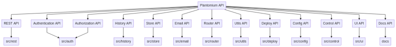

# Plantomium README

Bienvenid@ al `Plantomium README`.

Vaya a [`Plantomium REFERENCE`](./REFERENCE.md) si quiere consultar directamente la API.

## Índice

1. [Índice](#indice)
2. [Sobre Plantomium](#sobre-plantomium)
3. [Sobre las bondades de Plantomium](#sobre-las-bondades-de-plantomium)
4. [Sobre la API de Plantomium](#sobre-la-api-de-plantomium)
5. [Sobre...](#sobre)

## Sobre Plantomium

Plantomium es un **headless content management system**.

Plantomium ofrece una abstracción, con *una serie de bondades aparte*, entre:

  - [`node.js`](#): el entorno de trabajo base.
  - [`express`](#): el framework del back-end para interactuar con la web.
  - [`http`](#): el protocolo principal para comunicarse unidireccionalmente con la web.
  - [`socket.io`](#): el protocolo secundario para comunicarse bidireccionalmente con la web.
  - [`mysql`](#): el sistema de bases de datos principal.

## Sobre las bondades de Plantomium

Plantomium, además de ser un puente entre diversas tecnologías y protocolos, ofrece cobertura a muchos aspectos problemáticos de la web:

  - autentificación de usuarios
  - autorización de operaciones por usuario
  - acceso a datos
    - de una base de datos
    - de ficheros asociados
    - programáticamente
    - vía servidor
  - acceso a ficheros
    - en local
    - en remoto
  - histórico de datos
  - envíos de correo
  - utilidades generales
  - proceso de despliegue
  - ficheros de configuraciones
  - interfaz de usuario
    - modulable
    - funcional
    - avanzada
  - documentación

## Sobre la API de Plantomium

Aquí un pequeño diagrama de la API:

Aquí una breve explicación de la API:

  - **REST API**
    - se ocupa de ofrecer formas de consulta y manipulación de los datos
      - de la base de datos
      - de ficheros asociados a algunos tipos de datos
    - comprende a todas las tablas de la base de datos objetivo
      - con actores (actors)
      - con middlewares
      - con controladores (controllers)
      - con manejadores (handlers)
      - con consultas (queries)
      - con 1 misma conexión a la base de datos
    - ofreciendo una *HTTP RESTful API automáticamente*
    - configurable
      - para ocultar tablas, columnas y operaciones CRUD
      - para privatizar tablas, columnas y operaciones CRUD
    - adaptable a cualquier base de datos `mysql`
    - compatible con ficheros en local
    - con paginación
    - con pluralización de las operaciones CRUD
  - **Authentication API**
    - se ocupa de dotar de capacidad de identificación de cada petición con un usuario a la aplicación
    - con usuarios
      - confirmados
      - no confirmados
    - con grupos
    - con permisos
      - por grupo
      - por usuario
    - con sesiones
      - múltiples y limitables
      - que expiran
    - con token de identificación
      - como cabecera HTTP
      - por cada petición
    - en una API fácilmente extendible
      - con orientación a objetos
      - altamente modulada
  - **Authorization API**
    - se ocupa de dotar de capacidad de restricción de funcionalidades según usuario a la aplicación
    - a nivel:
      - programático
      - de endpoints
    - por cada operación CRUD * (plurales + schema).
    - por cada tabla y columna del modelo de datos.
  - **History API**
    - se ocupa de guardar y dar acceso a los datos históricos (obsoletos) que se han ido generando por la aplicación
    - los datos eliminados por la REST se registran como histórico
    - de este modo, no se pierden datos nunca
  - **Store API**
    - se ocupa de gestionar ficheros en local o remoto bajo una misma API
  - **Email API**
    - para enviar correos fácilmente
  - **Router API**
    - para ordenar la adhesión de las rutas a la aplicación y refrescarlas en vivo
  - **Utils API**
    - para facilitar la ampliación de funcionalidades globales del entorno
  - **Deploy API**
    - para centralizar el despliegue global del entorno
  - **Config API**
    - para centralizar los ficheros de configuración de la aplicación
  - **Control API**
    - para separar los comandos que pueden ejecutarse aparte
  - **UI API**
    - para aprovechar todo el potencial de un entorno de aplicaciones cliente como [**Vue**](#).
  - **Docs API**
    - para generar documentación chula como esta

## Sobre